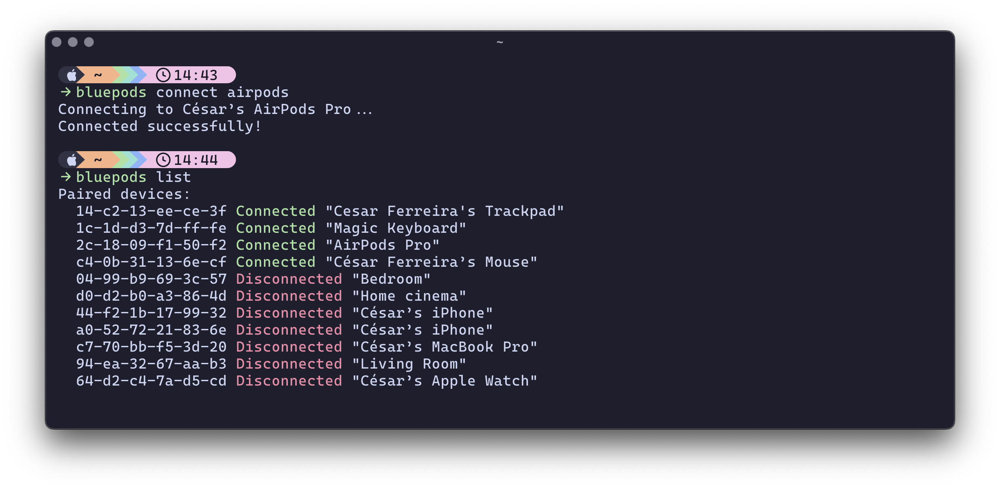
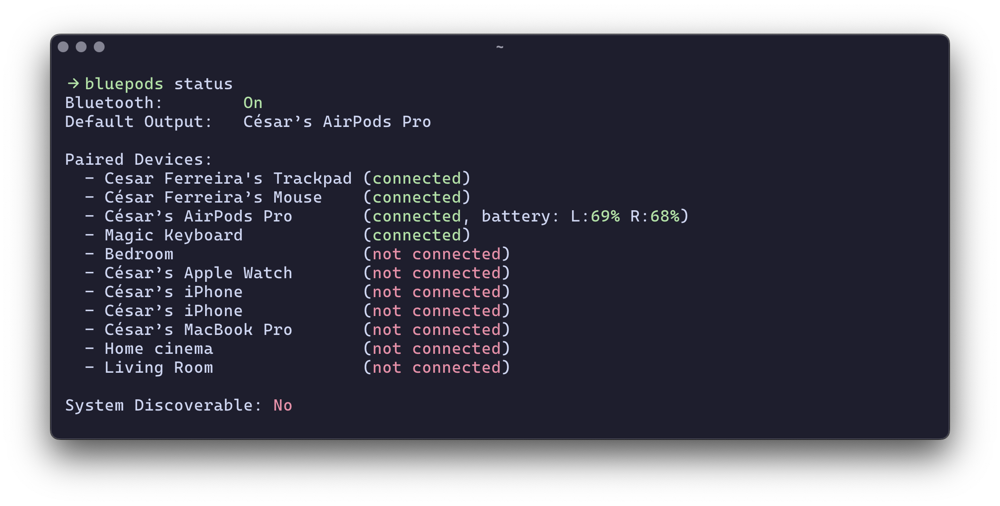

# BluePods

> A user-friendly CLI tool to manage Bluetooth devices on macOS.




## Prerequisites

- macOS
- [blueutil](https://github.com/toy/blueutil) installed (`brew install blueutil`)
- Rust and Cargo installed

## Installation

1. Install the `bluepods` binary using Cargo:
```bash
cargo install bluepods
```

This will install the `bluepods` binary in your system, making it available globally.

### Manual install
1. Clone this repository
2. Build and install the binary:
```bash
cargo install --path .
```

This will install the `bluepods` binary in your system, making it available globally.

## Usage

### Show Bluetooth Status
```bash
bluepods status
```




This will display a comprehensive overview of your Bluetooth system:
- Bluetooth power state
- Default audio output device
- List of paired devices with connection status
- System discoverable state

### List all paired devices
```bash
bluepods list
```

This will show all paired Bluetooth devices with their connection status.

### Connect to a device
```bash
bluepods connect "AirPods Pro"
```

### Disconnect from a device
```bash
bluepods disconnect "AirPods Pro"
```

You can use partial names for both connect and disconnect commands, and the search is case-insensitive:
```bash
bluepods connect airpods
bluepods disconnect airpods
```

If multiple devices match your search, you'll be shown a list to choose from.

## Features

- 🔍 Fuzzy search for device names
- 📱 Easy connection/disconnection to devices by name
- 🎨 Colored output for better visibility
- ✨ Case-insensitive matching
- 📊 Comprehensive system status view 